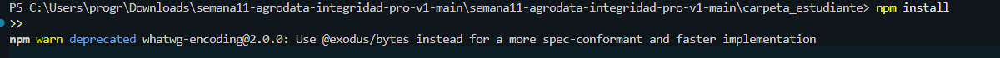
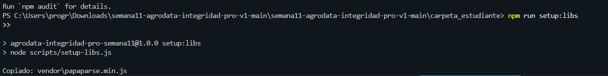
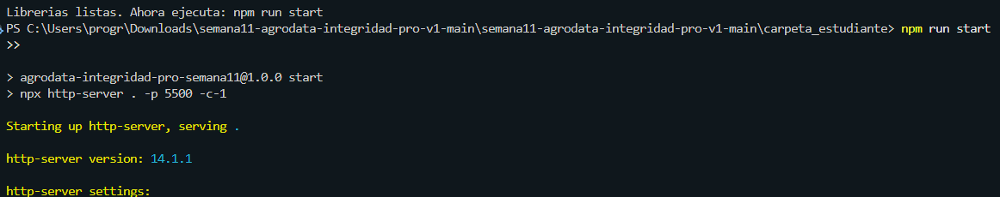

# Bitacora Semana 11 - Manejo de archivos y datos simples

## Nombre del estudiante 

Yesica velez

## 1. Preparacion del entorno

| Accion | Resultado obtenido | Captura o evidencia |
|---|---|---|
| Abri la carpeta en VS Code SI
| Ejecute `node -v` y `npm -v` SI
| Ejecute `npm install` 
| Ejecute `npm run setup:libs` 
| Ejecute `npm run start`

## 2. Revision de librerias

| Libreria | ¿Cargo correctamente? | Evidencia o error encontrado |
|---|---|---|
| PapaParse   SI
| Chart.js   SI
| SweetAlert2   SI
| Font Awesome  SI
| jsPDF   SI

## 3. Revision del archivo CSV

Archivo revisado: `data/produccion_base.csv`

| Registro | Problema encontrado | Tipo de problema | Correccion propuesta |
|---|---|---|---|
El problema encontrado fue Campo “cantidad” vacío ya que habia un dato faltante, la correcion fue Revisar fuente de datos y completar con el valor real de producción

## 4. Revision del archivo JSON

Archivo revisado: `data/inventario_base.json`

| Item | Problema encontrado | Tipo de problema | Correccion propuesta |
|---|---|---|---|
la correcion fue cambiar la letra a numero 10

## 5. Modificaciones realizadas en codigo

| Archivo | TODO o seccion modificada | Cambio realizado | Resultado obtenido |
|---|---|---|---|
| js/validators.js Se agregó verificación para evitar registros con valores nulos o menores a cero
| js/reports.js |  Se completó el bloque TODO-ESTUDIANTE para generar el reporte con encabezado y fecha

## 6. Conclusiones

Escribe una conclusion de 8 a 12 lineas sobre la importancia de manejar archivos, datos simples e integridad de informacion.

El manejo adecuado de archivos y datos simples es esencial para garantizar la integridad de la información en cualquier sistema. Cuando los datos se almacenan sin validaciones, pueden generar errores que afectan los cálculos, los reportes y la toma de decisiones. La revisión de archivos CSV y JSON permite detectar inconsistencias, valores vacíos o incoherentes, asegurando que la información sea confiable y útil. Implementar validaciones en JavaScript fortalece la calidad del sistema y evita que datos erróneos se propaguen. Además, la documentación de los hallazgos en una bitácora fomenta la trazabilidad y la mejora continua. En resumen, la integridad de los datos es la base para construir aplicaciones seguras, precisas y profesionales.
